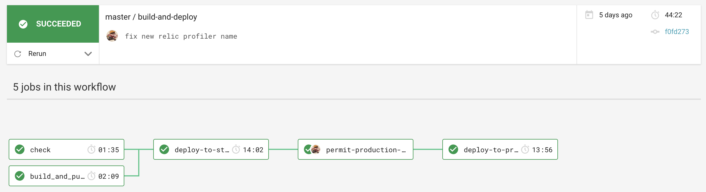

# LBH Base API

Base API is a boilerplate code for being reused for new APIs for LBH

## Stack

- .NET Core as a web framework.
- nUnit as a test framework.

## Dependencies

- Universal Housing Simulator

## Contributing

### Setup

1. Install [Docker][docker-download].
2. Install [AWS CLI][AWS-CLI].
3. Clone this repository.
4. Rename the initial template.
5. Open it in your IDE.

### Renaming

The renaming of `base-api` into `SomethingElseApi` can be done by running a Renamer powershell script. To do so:
1. Open the powershell and navigate to this directory's root.
2. Run the script using the following command:
```
.\Renamer.ps1 -apiName My_Api
```

If your ***script execution policy*** prevents you from running the script, you can temporarily ***bypass*** that with:
```
powershell -noprofile -ExecutionPolicy Bypass -file .\Renamer.ps1 -apiName My_Api
```

Or you can change your execution policy, prior to running the script, permanently with _(this disables security so, be cautious)_:
```
Set-ExecutionPolicy Unrestricted
```

After the renaming is done, the ***script will ask you if you want to delete it as well***, as it's useless now - It's your choice.

#### On OSX

Use Docker to run this script on Macs:
```
docker run -it -v `pwd`:/app mcr.microsoft.com/powershell
```

### Development

To serve the application, run it using your IDE of choice, we use Visual Studio CE and JetBrains Rider on Mac.

**Note**
When running locally the appropriate database conneciton details are still needed.
##### Postgres
For Postgres an approprate `CONNECTION_STRING` environment variable is needed,
and if you want to use a local Postgres instance then that will of course need to be installed and running.
##### DynamoDb
To use a local instance of DynamoDb, this will need to be installed. This is most easily done using [Docker](https://www.docker.com/products/docker-desktop).
Run the following command, specifying the local path where you want the container's shared volume to be stored.
```
docker run --name dynamodb-local -p 8000:8000 -v <PUT YOUR LOCAL PATH HERE>:/data/ amazon/dynamodb-local -jar DynamoDBLocal.jar -sharedDb -dbPath /data
```

If you would like to see what is in your local DynamoDb instance using a simple gui, then [this admin tool](https://github.com/aaronshaf/dynamodb-admin) can do that.

The application can also be served locally using docker:
1.  Add you security credentials to AWS CLI.
```sh
$ aws configure
```
2. Log into AWS ECR.
```sh
$ aws ecr get-login --no-include-email
```
3. Build and serve the application. It will be available in the port 3000.
```sh
$ make build && make serve
```

### Release process

We use a pull request workflow, where changes are made on a branch and approved by one or more other maintainers before the developer can merge into `master` branch.



Then we have an automated six step deployment process, which runs in CircleCI.

1. Automated tests (nUnit) are run to ensure the release is of good quality.
2. The application is deployed to development automatically, where we check our latest changes work well.
3. We manually confirm a staging deployment in the CircleCI workflow once we're happy with our changes in development.
4. The application is deployed to staging.
5. We manually confirm a production deployment in the CircleCI workflow once we're happy with our changes in staging.
6. The application is deployed to production.

Our staging and production environments are hosted by AWS. We would deploy to production per each feature/config merged into  `master`  branch.

### Creating A PR

To help with making changes to code easier to understand when being reviewed, we've added a PR template.
When a new PR is created on a repo that uses this API template, the PR template will automatically fill in the `Open a pull request` description textbox.
The PR author can edit and change the PR description using the template as a guide.

## Static Code Analysis

### Using [FxCop Analysers](https://www.nuget.org/packages/Microsoft.CodeAnalysis.FxCopAnalyzers)

FxCop runs code analysis when the Solution is built.

Both the API and Test projects have been set up to **treat all warnings from the code analysis as errors** and therefore, fail the build.

However, we can select which errors to suppress by setting the severity of the responsible rule to none, e.g `dotnet_analyzer_diagnostic.<Category-or-RuleId>.severity = none`, within the `.editorconfig` file.
Documentation on how to do this can be found [here](https://docs.microsoft.com/en-us/visualstudio/code-quality/use-roslyn-analyzers?view=vs-2019).

## Testing

### Run the tests

```sh
$ make test
```

To run database tests locally (e.g. via Visual Studio) and you are using Postgres the `CONNECTION_STRING` environment variable will need to be populated with:

`Host=localhost;Database=testdb;Username=postgres;Password=mypassword"`

Note: The Host name needs to be the name of the stub database docker-compose service, in order to run tests via Docker.

If changes to the database schema are made then the docker image for the database will have to be removed and recreated. The restart-db make command will do this for you.

### Agreed Testing Approach
- Use nUnit, FluentAssertions and Moq
- Always follow a TDD approach
- Tests should be independent of each other
- Gateway tests should interact with a real test instance of the database
- Test coverage should never go down
- All use cases should be covered by E2E tests
- Optimise when test run speed starts to hinder development
- Unit tests and E2E tests should run in CI
- Test database schemas should match up with production database schema
- Have integration tests which test from the PostgreSQL database to API Gateway

## Data Migrations
### A good data migration
- Record failure logs
- Automated
- Reliable
- As close to real time as possible
- Observable monitoring in place
- Should not affect any existing databases

## Contacts

### Active Maintainers

- **Selwyn Preston**, Lead Developer at London Borough of Hackney (selwyn.preston@hackney.gov.uk)
- **Mirela Georgieva**, Lead Developer at London Borough of Hackney (mirela.georgieva@hackney.gov.uk)
- **Matt Keyworth**, Lead Developer at London Borough of Hackney (matthew.keyworth@hackney.gov.uk)

### Other Contacts

- **Rashmi Shetty**, Product Owner at London Borough of Hackney (rashmi.shetty@hackney.gov.uk)

[docker-download]: https://www.docker.com/products/docker-desktop
[universal-housing-simulator]: https://github.com/LBHackney-IT/lbh-universal-housing-simulator
[made-tech]: https://madetech.com/
[AWS-CLI]: https://aws.amazon.com/cli/
